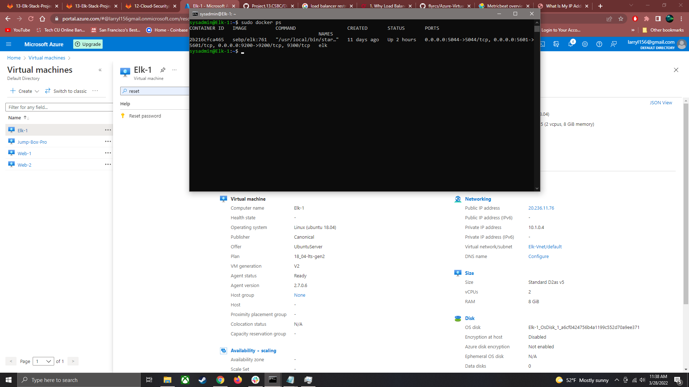

## Automated ELK Stack Deployment

The files in this repository were used to configure the network depicted below.

These files have been tested and used to generate a live ELK deployment on Azure. They can be used to either recreate the entire deployment pictured above. Alternatively, select portions of the playbook file may be used to install only certain pieces of it, such as Filebeat.

  -filebeat-playbook.yml, metricbeat-playbook.yml

This document contains the following details:
- Description of the Topologu
- Access Policies
- ELK Configuration
  - Beats in Use
  - Machines Being Monitored
- How to Use the Ansible Build

### Description of the Topology

The main purpose of this network is to expose a load-balanced and monitored instance of DVWA, the D*mn Vulnerable Web Application.

Load balancing ensures that the application will be highly efficient, in addition to restricting traffic to the network.
- _TODO: Load balancers protect availability by shuttling traffic so no one server becomes overwhelmed by requests if there are other servers available.
What is the advantage of a jump box?
	The jumpbox allows a person to work within the network in a more secure manner. In the case of this project, only the jumpbox may be accessed externally through ssh.

Integrating an ELK server allows users to easily monitor the vulnerable VMs for changes to the data and system logs.
- _TODO: What does Filebeat watch for?
	Filebeat looks for specified files or directories and pushes them to elasticsearch and logstash so.
- _TODO: What does Metricbeat record?_ Metricbeat records metrics from the system and certain services on the server

The configuration details of each machine may be found below.
_Note: Use the [Markdown Table Generator](http://www.tablesgenerator.com/markdown_tables) to add/remove values from the table_.

| Name     | Function  | IP Address    | Operating System |
|----------|---------- |------------   |------------------|
| Jump Box | Gateway   |20.231.227.88  | Linux            |
| Web-1    | Web       | 10.0.0.7      | Linux            |
| Web-2    | Web       | 10.0.0.6      | Linux            |
| ELK      | monitor   | 10.1.0.4      | Linux            |

### Access Policies

The machines on the internal network are not exposed to the public Internet. 

Only the jumpbox machine can accept connections from the Internet. Access to this machine is only allowed from the following IP addresses:
- _TODO: 98.234.191.16

Machines within the network can only be accessed by SSH
- _TODO: Which machine did you allow to access your ELK VM?
	Jumpbox can access ELK VM
	 What was its IP address?
	10.0.0.4

A summary of the access policies in place can be found in the table below.

| Name     | Publicly Accessible | Allowed IP Addresses |
|----------|---------------------|----------------------|
| Jump Box | Yes                 | 98.234.191.16        |
|          |                     |                      |
|          |                     |                      |

### Elk Configuration

Ansible was used to automate configuration of the ELK machine. No configuration was performed manually, which is advantageous because...
- _TODO: What is the main advantage of automating configuration with Ansible?_ Ansible will push the playbook on all relevant servers rather than having to configure each server individually gaining more value as a network grows.

The playbook implements the following tasks:
- _TODO: In 3-5 bullets, explain the steps of the ELK installation play. E.g., install Docker; download image; etc._
- ...Install docker
- ...Install python-pip3 and docker module
- ...Increase memory and use more memory
- ...Install and launch ELK container
- ...Launch ELK on boot

The following screenshot displays the result of running `docker ps` after successfully configuring the ELK instance.

### Target Machines & Beats
This ELK server is configured to monitor the following machines: Web-1 Web-2
- _TODO: List the IP addresses of the machines you are monitoring_ 10.0.0.7 10.0.0.6

We have installed the following Beats on these machines: ELK-1	
- _TODO: Specify which Beats you successfully installed_ filebeat metricbeat

These Beats allow us to collect the following information from each machine:
- _TODO: In 1-2 sentences, explain what kind of data each beat collects, and provide 1 example of what you expect to see. E.g., `Winlogbeat` collects Windows logs, which we use to track user logon events, etc._
filebeat collects system/log data in specified files or directories. Metric beat collects metric data on systems or certain services.

### Using the Playbook
In order to use the playbook, you will need to have an Ansible control node already configured. Assuming you have such a control node provisioned: 

SSH into the control node and follow the steps below:
- Copy the ELK installation file to ELK VM
- Update the ansible host file to include elk server
- Run the playbook, and navigate to http://20.236.11.76:5601/app/kibana#/home to check that the installation worked as expected. # uses elk-1 ip

_TODO: Answer the following questions to fill in the blanks:_
- _Which file is the playbook? Where do you copy it? Elk-install.yml copied onto ELK container in elk-1 VM
- _Which file do you update to make Ansible run the playbook on a specific machine?
	Playbook to specify what host and ansible host file to specify what systems can be hosts
 Playbook How do I specify which machine to install the ELK server on versus which to install Filebeat on?_ specify the host
- _Which URL do you navigate to in order to check that the ELK server is running? http://20.236.11.76:5601/app/kibana#/home 

_As a **Bonus**, provide the specific commands the user will need to run to download the playbook, update the files, etc._
ansible-playbook # runs playbook
curl [URL] can download specified playbook
nano [playbook] # nano is an editing tool

